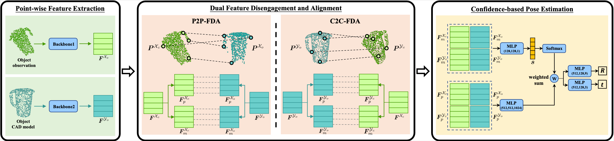

# DCL-Net
<center> 
 
</center>

## Datasets
This work is trained on YCB-Video and LineMOD dataset, and tested on YCB-Video and LineMOD&Occlusion LineMOD respectively.
- YCB-Video Dataset: 
  - Download YCB-Video dataset from [PoseCNN](https://rse-lab.cs.washington.edu/projects/posecnn/).
  - Download the predicted masks from [PVN3D](https://pan.baidu.com/s/1wkF-5zhRDZD7ZnZFhxbm2A?pwd=cb49)/[FFB6D](https://pan.baidu.com/s/187mpjD3YW6RK66exfcZakg?pwd=2dy7)(The results reported in paper use the masks predicted by FFB6D).
- LineMOD Dataset: Download preprocessed LineMOD dataset and also the masks from [DenseFusion](https://github.com/j96w/DenseFusion)
- Occlusion-LineMOD
  - Download Occlusion LineMOD dataset from [HybridPose](https://github.com/chensong1995/HybridPose), and also [the masks predicted by HybridPose](https://pan.baidu.com/s/1W-pIxSXUsordqRqxqh0Vzw?pwd=x6st) for evaluation.
- Put the downloaded datasets and masks into the "datasets" folder, please refer to [Code Structure](#Code_Structure) section for more detail.

## SetUp
- Install torch1.3.0 and CUDA10.1 .
- Install dependencies:
  ```
    matplotlib==3.3.4
    seaborn==0.11.2
    opencv-python==4.6.0
    sklearn
    open3d==0.8.0.0
    gorilla-core==0.2.7.8
    torchvision==0.4.1
    h5py
    autolab_core
    transforms3d
    ipdb
    pillow==6.1
  ```
- Compile and install the libraries:
  ```
    conda install --yes -c bioconda   google-sparsehash
    cd libs/spconv/
    bash install.sh
    cd ../pointgroup_ops 
    bash install.sh 
    cd ../pointnet_sp
    bash install.sh
    cd ../pointnet_lib    
    bash install.sh
  ```
## Trained weights
|model|Dataset|Results|URL|
|:---:|:---:|:---:|:---:|
|DCL-Net|YCB-Video|Mean ADD-S AUC: 95.8<br> Mean ADD-S<2cm: 99.0|[URL](https://pan.baidu.com/s/1YrM6xan3-27e9nek3S_kZg?pwd=iffm)|
|refiner|YCB-Video|Mean ADD-S AUC: 96.6<br> Mean ADD-S<2cm: 99.0|[URL](https://pan.baidu.com/s/1ju_Jbz1NlgIvteo3lkNBkQ?pwd=w6e7)|
|DCL-Net|LineMOD<br>Occlusion LineMOD|Mean ADD(S)<0.1d: 99.5<br> Mean ADD(S)<0.1d: 70.6|[URL](https://pan.baidu.com/s/1q_Of_P08XQWBKSJLPGSElA?pwd=fu3d)|

>Download and unzip these files, and put them into "log" directory for evaluation, please refer to [Code Structure](#Code_Structure) section for more detail.
## Example training/evaluation
After you have downloaded and setup the environment, simply execute the corresponding shell script to train or evaluate DCL-Net.
```
bash scripts/script_eval_YCBV_stage1.sh
bash scripts/script_train_YCBV_stage1.sh
```
## Code Structure
**DCL_Net** \
**|--- configs** \
**|--- |--- config_LM.yaml:** Configuration for the experiments of LineMOD/Occlusion LineMOD dataset. \
**|--- |--- config_YCBV_32/40.yaml:** Configurations for the experiments of YCB-Video dataset.

**|--- datasets** \
**|--- |--- Linemod_preprocessed:** The LineMOD dataset, . \
**|--- |--- occlusion_linemod:** The Occlusion LineMOD dataset, from [HybridPose](https://github.com/chensong1995/HybridPose). \
**|--- |--- LMO_Masks:** The masks for the evaluation of Occlusion LineMOD(the prediction of [HybridPose](https://github.com/chensong1995/HybridPose). \
**|--- |--- YCB_Video_Dataset:** The YCB-Video dataset. \
**|--- |--- YCBV_Masks:** The masks for the evaluation of YCB-Video dataset. \
**|--- |--- |--- Masks_PVN3D:** The masks predicted by PVN3D. 
**|--- |--- |--- Masks_FFB6D:** The masks predicted by FFB6D. 

**|--- LM:** \
**|--- |--- dataloader_train_LM.py:** The dataloader for the training set of LineMOD dataset. \
**|--- |--- dataloader_test_LM.py:** The dataloader for the test set of LineMOD dataset. \
**|--- |--- dataloader_test_LMO.py:** The dataloader for the test set of Occlusion LineMOD dataset.

**|--- YCBV** \
**|--- |--- dataloader_train_YCBV.py:** The dataloader for the training set of YCB-Video dataset. \
**|--- |--- dataloader_test_YCBV.py:** The dataloader for the test set of YCB-Video dataset. \
**|--- |--- utils_YCBV** \
**|--- |--- |--- train_data_list.txt:** The list of the training set for YCB-Video dataset. \
**|--- |--- |--- test_data_list.txt:** The list of the test set for YCB-Video dataset. \
**|--- |--- CADs:** The CAD models of YCB-Video dataset.

**|--- libs** \
**|--- |--- pointgroup_ops:** Some operations of sparse tensor, refers to [PointGroup](https://github.com/dvlab-research/PointGroup). \
**|--- |--- pointnet_ops:** Some operations for the pointcloud, such as knn, refers to [PointNet++](https://github.com/erikwijmans/Pointnet2_PyTorch). \
**|--- |--- pointnet_sp:** Some operations for the pointcloud, where the dimension of batch_id is also considered. \
**|--- |--- spconv:** The lib of Sparse Convolution, refers to [spconv](https://github.com/traveller59/spconv).

**|--- models** \
**|--- |--- DCL_Net.py:** The proposed DCL-Net. \
**|--- |--- refiner.py:** The proposed refiner. \
**|--- |--- Modules.py:** Some basic modules for the construction of network.

**|--- scripts** \
**|--- |--- script_train_LM.sh:** A shell script to execute the training process of DCL-Net on LineMOD dataset conveniently. \
**|--- |--- script_eval_LM.sh:** A shell script to execute the evaluation of DCL-Net on LineMOD dataset conveniently. \
**|--- |--- script_eval_LMO.sh:** A shell script to execute the evaluation of DCL-Net on Occlusion LineMOD dataset conveniently. \
**|--- |--- script_train_YCBV_stage1.sh:** A shell script to execute the training of DCL-Net on YCB-Video dataset conveniently. \
**|--- |--- script_train_YCBV_stage2.sh:** A shell script to execute the training of refiner on YCB-Video dataset conveniently. \
**|--- |--- script_eval_YCBV_stage1.sh:** A shell script to execute the evaluation of DCL-Net on YCB-Video dataset conveniently. \
**|--- |--- script_eval_YCBV_stage2.sh:** A shell script to execute the evaluation of DCL-Net+refiner on YCB-Video dataset conveniently.

**|--- tools** \
**|--- |--- train_LM.py:** A python script describe the detailed training process of DCL-Net on LineMOD dataset. \
**|--- |--- test_LM.py:** A python script describe the detailed evaluation process of DCL-Net on LineMOD dataset. \
**|--- |--- test_LMO.py:** A python script describe the detailed evaluation process of DCL-Net on Occlusion LineMOD dataset. \
**|--- |--- train_YCBV_stage1.py:** A python script, describing the detailed training process of DCL-Net on YCB-Video dataset. \
**|--- |--- train_YCBV_stage2.py:** A python script, describing the detailed training process of refiner on YCB-Video dataset. \
**|--- |--- test_YCBV_stage1.py:** A python script, describing the detailed evaluation process of DCL-Net on YCB-Video dataset. \
**|--- |--- test_YCBV_stage2.py:** A python script, describing the detailed evaluation process of DCL-Net+refiner on YCB-Video dataset.

**|--- log** \
**|--- |--- DCL_Net_config_YCBV_bs32_id0:** Contains the checkpoint and also the training/test log of an experiment that is based on the "DCL-Net" model and "config_YCBV_bs32" configuration on YCB-Video dataset. \
**|--- |--- refiner_refiner_config_YCBV_bs40_id0_model_DCL_Net_config_YCBV_bs32_id0_epoch_84:** Contains the checkpoint and also the training/test log of an experiment for refiner based on "DCL_Net_config_YCBV_bs32_id0" on YCB-Video dataset. \
**|--- |--- DCL_Net_config_LM_id0:** Contains the checkpoint and also the training/test log of an experiment that is based on the "DCL-Net" model and "config_LM" configuration on LineMOD.

**|--- utils:**

**|--- figs**

**|--- README.md**
